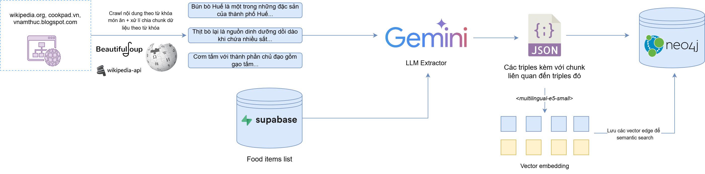
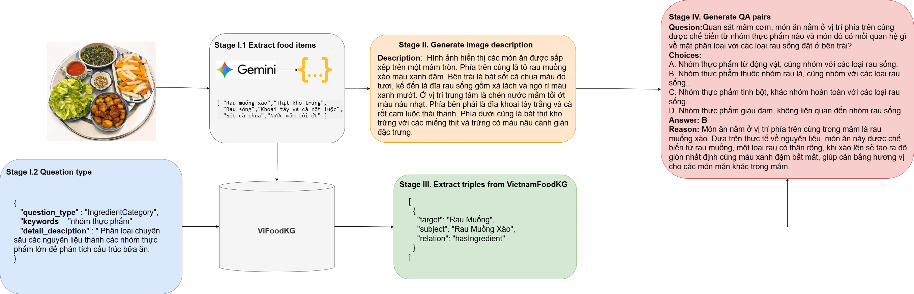

<div align="center">

  # ViFoodVQA: Multi-Hop Reasoning Visual Question Answering Dataset with Vietnamese Food Knowledge Graph

  
  
  
  
  

</div>

---

**ViFoodVQA** is a Vietnamese food Visual Question Answering dataset project.
It builds multiple-choice Vietnamese VQA samples for meal images, grounds those
questions in a Vietnamese food knowledge graph, and verifies the resulting
dataset through a human review workflow.

The repository contains the full dataset construction pipeline: Supabase schema
migrations, ViFoodKG construction code, ViFoodVQA generation code, Streamlit
verification tooling, and supporting ontology/configuration files.

## Pipeline Overview

ViFoodVQA is built through three connected workflows: image collection, knowledge
graph construction, and VQA sample generation.

### Image Collection Pipeline

The image pipeline crawls Vietnamese meal images, filters noisy or irrelevant
results, and prepares image metadata for the Supabase `image` table.

<p align="center">
  
</p>

### ViFoodKG Construction Pipeline

ViFoodKG is the knowledge layer used to ground ViFoodVQA questions. It extracts
food entities, classifies them, generates culinary triples, ingests them into
Neo4j, and vectorizes graph edges for retrieval.

<p align="center">
  
</p>

### ViFoodVQA Generation Pipeline

The VQA pipeline retrieves relevant KG paths for each image, builds answer
candidates, prompts Gemini to generate Vietnamese multiple-choice VQA rows, and
sends the rows to Supabase for human verification.

<p align="center">
  
</p>

## Current Snapshot

Live counts documented on 2026-04-28:

| Metric | Value | Source |
| --- | ---: | --- |
| Verified images | 1,426 | Supabase live `image` table |
| Canonical VQA pairs | 8,910 | Supabase live `vqa` table, split-aware policy |
| KG nodes | 3,382 | Neo4j live |
| KG triples / relationships | 9,765 | Neo4j live |
| KG relationship types | 12 | Neo4j live |

Before updating public numbers, rerun:

```bash
python ViFoodVQA/src/scripts/collect_ground_truth_stats.py --format markdown
```

## Repository Structure

From this repository root:

| Path | Purpose |
| --- | --- |
| [`streamlit/`](streamlit/) | Streamlit app for verifying images, VQA rows, and linked KG triples in Supabase. |
| [`supabase/`](supabase/) | Ordered SQL migrations used throughout dataset construction, from image/VQA tables to triple review and edit logs. |
| [`ViFoodKG/`](ViFoodKG/) | Source code for building ViFoodKG: entity extraction, entity classification, triple extraction, Neo4j ingestion, and edge vectorization. |
| [`ViFoodVQA/`](ViFoodVQA/) | Source code for generating ViFoodVQA samples: KG retrieval, candidate construction, Gemini prompting, import/export scripts, and Hugging Face dataset publishing helpers. |
| [`config/`](config/) | Shared ontology and question type references used by the KG, VQA, and verification workflows. |
| [`docs/`](docs/) | Architecture notes, contracts, retrieval reports, verification guideline, and known issue reports. |
| [`images/`](images/) | README pipeline diagrams for image crawling, ViFoodKG construction, and ViFoodVQA generation. |

## End-to-End Flow

```text
Meal image metadata
  -> Supabase image table
  -> ViFoodKG entity extraction and classification
  -> Gemini/Wikipedia triple extraction
  -> Neo4j graph ingestion
  -> KG edge/path vectorization
  -> ViFoodVQA retrieval and candidate construction
  -> Gemini VQA generation
  -> Supabase vqa table
  -> Streamlit human verification
  -> Hugging Face JSONL/images export
```

ViFoodKG is therefore a supporting knowledge layer. The target artifact of this
repository is the **ViFoodVQA dataset**.

## Main Components

### ViFoodKG

`ViFoodKG/` builds the domain knowledge graph used to ground question
generation.

| Stage | Script | Output |
| --- | --- | --- |
| Entity extraction | `ViFoodKG/src/01_kg_entity_extractor.py` | Unique food labels from Supabase images |
| Entity classification | `ViFoodKG/src/02_kg_entity_classifier.py` | Normalized culinary entities |
| Triple extraction | `ViFoodKG/src/03_kg_triple_extractor.py` | Structured food knowledge triples |
| Neo4j ingestion | `ViFoodKG/src/04_kg_neo4j_ingestor.py` | Nodes and relationships in Neo4j |
| Vectorization | `ViFoodKG/src/05_kg_vectorizer.py` | Embeddings and vector index on graph edges |

### ViFoodVQA

`ViFoodVQA/` generates dataset rows by retrieving KG paths for food items in an
image, building answer candidates, and prompting Gemini to create Vietnamese
multiple-choice VQA samples.

Key entry points:

| File | Role |
| --- | --- |
| `ViFoodVQA/src/query.py` | KG retriever and CLI for local path retrieval. |
| `ViFoodVQA/src/01_generate_vqa.py` | Main VQA generation pipeline. |
| `ViFoodVQA/src/02_debug_missing_vqa.py` | Debug reruns for missing image/question-type coverage. |
| `ViFoodVQA/src/03_split_dataset.py` | Dataset split helper. |
| `ViFoodVQA/src/scripts/import_vqa.py` | Import generated VQA JSON into Supabase. |
| `ViFoodVQA/src/scripts/map_vqa_triples_to_kg.py` | Maintain `kg_triple_catalog` and VQA-triple mapping rows. |
| `ViFoodVQA/src/scripts/export_hf_dataset.py` | Export Supabase rows to Hugging Face-style JSONL/images. |
| `ViFoodVQA/src/scripts/upload_hf_dataset.py` | Push the local export with the Hugging Face `datasets` library. |

Supported question types include ingredients, cooking technique, flavor
profile, origin/locality, allergen restrictions, dietary restrictions,
ingredient category, food pairings, dish classification, and substitution
rules.

### Streamlit Verification App

`streamlit/` contains the review UI for dataset quality control. The app lets
annotators:

- verify and drop images,
- review generated VQA rows,
- score each VQA with the current 3-criterion rubric,
- inspect and edit triples linked to a VQA row,
- save KEEP/DROP decisions and audit metadata back to Supabase.

See [`docs/VERIFY_VQA_GUIDELINE.md`](docs/VERIFY_VQA_GUIDELINE.md) for the
rubric used by annotators.

### Supabase Migrations

`supabase/` contains the canonical database migrations. Run them in order:

```text
supabase/000_image_vqa_triple.sql
supabase/001_vqa_kg_triple_map.sql
supabase/002_kg_triple_edit_log.sql
```

These migrations define the image table, VQA table, triple catalog,
VQA-to-triple mapping, verification columns, and triple edit log used during
dataset construction.

## Setup

### Prerequisites

- Python 3.11 or newer
- Supabase project
- Neo4j AuraDB or local Neo4j instance
- Google Gemini API key
- Optional Hugging Face token for dataset upload

### Environment Files

Create module-local `.env` files from the examples:

```bash
cp ViFoodKG/.env.example ViFoodKG/.env
cp ViFoodVQA/.env.example ViFoodVQA/.env
```

Fill in the required credentials:

```text
SUPABASE_URL
SUPABASE_KEY
GEMINI_API_KEY
NEO4J_URI
NEO4J_USERNAME
NEO4J_PASSWORD
```

For the Streamlit app, provide Supabase credentials through Streamlit secrets or
environment variables. See [`streamlit/README.md`](streamlit/README.md) for the
deployment notes.

### Install Dependencies

The KG and VQA batch pipelines share most Python dependencies through the KG
package:

```bash
cd ViFoodKG
pip install -e ".[dev]"
```

Install the verification app dependencies separately:

```bash
cd streamlit
pip install -r requirements.txt
```

## Common Workflows

### Build or Refresh ViFoodKG

```bash
cd ViFoodKG
python src/01_kg_entity_extractor.py
python src/02_kg_entity_classifier.py
python src/03_kg_triple_extractor.py
python src/04_kg_neo4j_ingestor.py
python src/05_kg_vectorizer.py
```

### Test KG Retrieval

```bash
cd ViFoodVQA
python src/query.py -i "Pho Bo" -q "nguyen lieu" -k 5
python src/query.py -i "Banh Xeo" -q "chat gay di ung" -k 3 --json
```

### Generate VQA Samples

```bash
cd ViFoodVQA
python src/01_generate_vqa.py --limit-images 20
python src/01_generate_vqa.py --qtypes ingredients origin_locality
```

### Run the Verification App

```bash
cd streamlit
streamlit run app.py
```

### Export the Hugging Face Dataset Layout

```bash
cd ViFoodVQA
python src/scripts/export_hf_dataset.py --export-by-split --download-images
```

By default, this writes JSONL files and optional downloaded images under
`hf_dataset/` in the current working directory. Use `--hf-dir` if you want to
write the export elsewhere.

## Documentation Map

| Doc | Purpose |
| --- | --- |
| [`ViFoodKG/README.md`](ViFoodKG/README.md) | Detailed guide for the KG construction module. |
| [`ViFoodVQA/README.md`](ViFoodVQA/README.md) | Detailed guide for the VQA generation module. |
| [`streamlit/README.md`](streamlit/README.md) | Detailed guide for the verification app. |
| [`docs/architecture.md`](docs/architecture.md) | Canonical architecture and artifact flow inside this repository. |
| [`docs/contracts/triple_schema.md`](docs/contracts/triple_schema.md) | Triple JSON interface contract. |
| [`docs/contracts/ontology_config.md`](docs/contracts/ontology_config.md) | Ontology governance and change impact. |
| [`docs/VERIFY_VQA_GUIDELINE.md`](docs/VERIFY_VQA_GUIDELINE.md) | Human verification rubric. |
| [`docs/retrieve_logic_changes_report.md`](docs/retrieve_logic_changes_report.md) | Retrieval strategy notes. |
| [`docs/KNOWLEDGE_GAP_REPORT.md`](docs/KNOWLEDGE_GAP_REPORT.md) | KG coverage and enrichment history. |

## Change Notes

- Keep the three `question_types.csv` copies synchronized across `ViFoodKG/`,
  `ViFoodVQA/`, and `streamlit/`.
- Changing triple shape affects retrieval, generation, import/export,
  Streamlit parsing, Supabase JSONB columns, and the Hugging Face schema.
- Changing ontology relation names affects KG extraction, Neo4j ingestion,
  vectorization, retrieval, candidate constructors, Streamlit review, and docs.
- Treat generated `hf_dataset/` folders as export artifacts. Prefer
  regenerating them through `ViFoodVQA/src/scripts/export_hf_dataset.py`
  instead of hand-editing rows or images.
- Never commit `.env` files, Streamlit secrets, Supabase keys, Neo4j passwords,
  Gemini keys, or Hugging Face tokens.

## License

This project is developed as part of academic research at HCMUS.
